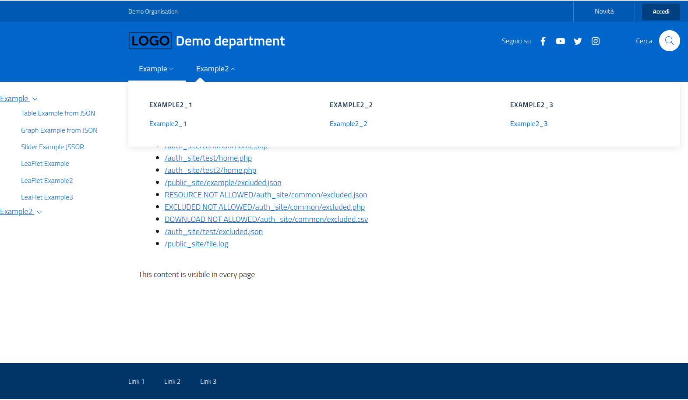

# EasyPortal PHP

### Un semplice sito web implementato in PHP facilmente configurabile che utilizza la libreria bootstrap-italia e il layout `TEMPLATE VUOTO SENZA "STICKY HEADER"`



- easyportal permette di creare uno scheletro di sito web secondo questo template https://italia.github.io/bootstrap-italia/docs/esempi/template-vuoto/, il sito può essere configurato per avere delle pagine pubbliche (sotto directory `public_site`) e delle pagine visibili solo tramite autenticazione di utente e password (sotto directory `auth_site`), all'interno di queste due sotto directory possono essere caricati file `HTML` o `PHP` anche contenenti codice `javascript`. I menu di navigazione `megamenu` vengono configurati tramite semplici file di testo `.menu`.

- La directory `core` continene il codice PHP del sito, la directory `docker` contiene i file necessari alla dockerizzazione del sito, le directory `public_site` e `auth_site` contengono le pagine del sito, la directory `local` contiene file di configurazione del sito per la gestione degli utenti/gruppi, il file `local.json` è un file di configurazione del sito, tutte le restanti directory sono relative a `bootstrap-italia`

## ISTRUZIONI PER L'ESECUZIONE DEL SITO

1. clone
```sh
git clone https://github.com/Arpapiemonte/easyportal
```
 
2. configurazione e build:
```sh
make
```

3. avvio l'app:
```sh
docker-compose up
```

4. visualizzo l'app:
- http://localhost:8008/ (PHP diretto)
- https://localhost:8080/ (PHP diretto)
- http://localhost/app/ (nginx reverse proxy)

## REQUIREMENTS

Il modo più semplice per testare ed iniziare ad utilizzare il framework è tramite Docker. 

I requisiti minimi sono quindi:

- Docker (engine version >= 18.06.0+)
- Docker Compose (Docker Compose file v3.7)

Il framework utilizza una serie di librerie, già incluse, che sono elencate di seguito 
con alcuni comandi di esempio per il loro aggiornamento:

- javascript jquery
    - cd js/
    - wget https://code.jquery.com/jquery-3.6.0.min.js
    - ln -s jquery-3.6.0.min.js jquery.min.js

- bootstrap italia
    - wget https://github.com/italia/bootstrap-italia/releases/download/v1.6.4/bootstrap-italia.zip
    - wget https://github.com/italia/bootstrap-italia/releases/download/v2.3.2/bootstrap-italia.zip
    - mkdir -p bootstrap-italia-2.3.2/dist
    - cp -v bootstrap-italia.zip bootstrap-italia-2.3.2/dist
    - cd bootstrap-italia-2.3.2/dist
    - unzip bootstrap-italia.zip
    - cd ../../
    - ln -snf bootstrap-italia-2.3.2 bootstrap-italia

- tabulator Internet Explorer compatibility
    - http://tabulator.info/docs/4.4/browsers
    - cd js
    - wget https://cdn.jsdelivr.net/npm/promise-polyfill@8/dist/polyfill.min.js
    - wget https://github.com/github/fetch/archive/v3.6.1.tar.gz
    - tar xvzf v3.6.1.tar.gz fetch-3.6.1/fetch.js
    - ln -s fetch-3.6.1/fetch.js fetch.js

- leaflet
    - wget http://cdn.leafletjs.com/leaflet/v1.7.1/leaflet.zip
    - copy leaflet.js* in js/leaflet.js*
    - copy leaflet.css in css/leaflet.css

> Avvertenza: nessuna directory/subdirectory deve chiamarsi public_site o auth_site oltre a /public_site e /auth_site

> il file .menu deve contenere i link dei menu nav l'indicazione NAV1 NAV2 NAV3 o NAV4 servono per popolare la voce del megamenu

>i file *.tab devono avere come ultima campo il testo del menu che li indirizza altrimenti perderà il current nav

## PER INIZIARE

Per semplificare le operazioni di build ed esecuzione tramite docker, tutti i comandi principali sono racchiusti nel file `Makefile`

Per la prima esecuzione è sufficiente lanciare il comando

`make`

Si occupera di inizializzare il progetto, eseguire la build delle immagini ed eseguirle con Docker Compose.

Se sul proprio sistema è presente il comando `docker buildx` si può invece usare:

`make dev`

Esegue le stesse operazioni già descritte ma sfrutta `buildx` per la build delle immagini.

Una volta terminate tutte le operazioni, visitare:
- `localhost/app` per accedere all'homepage tramite proxy pass
- `localhost:8080/app` per accedere all'homepage direttamente

## Configurazione del progetto

Dopo la prima inizializzazione si potrà personalizzare il framework secondo le proprie esigenze.

La configurazione avviene su diversi livelli:
- tramite Docker: l'immagine può essere personalizzata modificando `docker/Dockerfile` per aggiungere le proprie dipendenze
- tramite `.env`: possono essere modificate alcune impostazioni generali dell'applicazione
- tramite il file `local.json` (o `prod.json`) possono essere aggiunti contenuti personalizzati

> Se non si è svolta l'inizializzazione tramite Makefile, seguire i seguenti step:
> - copiare `.env.example` in un nuovo file `.env`
> - copiare `docker/Dockerfile.example` in un nuovo file `docker/Dockerfile`

### Il file `.env`

Le voci presenti nel file env sono

- **ENV**: l'ambiente dell'applicazione. I valori sono tipicamente **local** o **production**. Possono essere settati altri valori, 
purchè esista il corrispondente file {env}.json nella root del progetto. Ad esempio se l'ambiente fosse **staging** sarebbe necessario creare `staging.json` nella root.
Il file `local.json` può essere usato come punto di partenza.
- **TITLE**: il titolo del sito
- **PUBLIC_SITE**: directory dove mettere i file pubblici
- **AUTH_SITE**: directory dove mettere i file sotto autenticazione
- **BOOTSTRAP_ITALIA_VERSION**: **1** or **2** (ricorda il link simbolico ln -snf bootstrap-italia-2.2.0 bootstrap-italia or  ln -snf bootstrap-italia-1.6.4 bootstrap-italia)
- **MENU_SIDE**: **true** o **false**
- **SITE_TYPE**: **intranet** o **extranet**, in sostanza abilita o disabilita le sezioni pubbliche
- **LOG**: **true** o **false**, indica se l'applicazione può stampare eventuali log durante l'esecuzione. Tipicamente sarà impostata a **true** per l'ambiente **local**, e a **false** altrimenti
- **BASE_URL**: **/{my-base-url}** indica il base url dell'applicazione. Se modificato va aggiornata anche la relativa configurazione del proxy pass. Per l'ambiende di sviluppo, significa modificare il file `docker/nginx.conf`. 
L'unica location presente nel file rappresenta questo base url.
- **MAX_CSV_ARRAY_SIZE**: valore numerico per la validazione dei menu. Ogni menu è definito con un file `.menu` (contiene un CSV), ad esempio `public_site/example/example.menu`.
Il valore di questa impostazione viene usato per validare il numero di campi contenuti in ogni riga del CSV
- **MAX_MENU_NAV**: valore numerico che indica il massimo numero di element NAV presenti nel menù. Ogni file `.menu` può contenere uno o più nav. Ogni NAV è identificato dal primo valore di ogni riga del CSV. 
- **NEWS_PROVIDER**: permette di selezionare uno script per mostrare o nascondere la sezione news. Lo script va creato all'interno di `core/news` e va indicato solo il nome dello script senza path. Ad esempio `example_news.php`. 
Lasciando il campo vuoto la pagina news non sarà accessibile e verrà nascosto il link nella top navbar
- **AUTH_PROVIDER**: permette di selezionare uno script per gestire l'autenticazione. Il funzionamento è analogo a NEWS_PROVIDER, e gli script sono nella directory `core/login`
- **CHANGE_PASSWORD_PROVIDER**: permette di selezionare uno script per gestire il cambio password. Il funzionamento è analogo a NEWS_PROVIDER, e gli script sono nella directory `core/changepassword`
- **ORG_NAME**: permette di impostare il nome della propria organizzazione, visualizzato in ogni pagina nella top navbar
- **ORG_DEPARTMENT**: permette di impostare il nome della propria divisione, mostrato in ogni pagina accanto al logo
- **ORG_LOGO**: permette di impostare il logo. Il file del logo andrà posizionato nella root del progetto
- **PAGE_CONTENT**: permette di selezionare uno script che viene incluso in ogni pagina, dopo il contenuto della pagina e prima del footer. Utile per mostrare un contenuto fisso in ogni pagina. 
Lo script va indicato con le stesse regole di NEWS_PROVIDER, e va creato in `core/content`
- **ENABLED_FILES**: visto che il framework blocca l'accesso a tutti i files non abilitati, se si vogliono aggiungere documenti, immagini o altri files all'elenco si possono inserire a questa voce.
I path devono cominciare con `/`. Se vi sono più valori possono essere separati da `,`. Ad esempio ENABLED_FILES="/file1.png,/file2.pdf"

### Il file local.json

In questo file si trovano gli array di pagine da escludere quelle che non devono ricevere replaces, le configurazioni dei menu e dei tab, i link social e i link del footer.

## Aggiungere contenuti

Nuove directory possono essere aggiunte all'interno `/public_site` e `/auth_site`.
Ogni directory dovrebbe contenere il suo file `.menu` con link ai files della propria sezione.

L'accesso a sezione protette da autenticazione può essere gestito dall'amministratore

## Amministrazione

I permessi sono salvati su file, e si possono trovare in una directory relativa all'environment. 
Ad esempio se nel `.env` il valore `ENV` è **local** esisterà una directory `local` contenente diversi files. 

Per local questa directory è già esistente, per altri ambienti andrà creata. Per il passaggio a produzione si può usare il comando `make init.prod` per eseguire tutti i passaggi necessari, tra i quali la creazione di questa directory.

Se la directory dovesse essere vuota significa che non è ancora stato identificato un utente amministratore. In questo caso, ogni utente con credenziali di accesso sarà riconosciuto come amministratore fino a che non viene creata la prima configurazione.

L'ambiente local prevede l'accesso con un server LDAP, si può accedere con l'utente `admin` e password `mypass`.

Nella top navbar è presente la voce "Admin". Nella sezione admin si possono aggiungere utenti, gruppi e percorsi.

Nella seconda sezione della pagina admin tramite select si potranno selezionare i valori aggiunti in precedenza per assegnare gli utenti ai propri gruppi, e decidere quali path sono visibili ad ogni gruppo.

I path visibili al gruppo compariranno a menù una volta autenticati con l'utente corretto.

Le utenze disponibili per sviluppo sono visibili  nel file `docker/ldap/users.ldif`. Modificando il file e facendo ripartiere l'immagine LDAP, il server LDAP di sviluppo verrà aggiornato con i nuovi campi o utenti inseriti nel file.

## I MENU E LE RICERCHE DEI TAG CONTENUTI DEL SITO

I menu sono dinamici sulla base di file csv di configurazione.
I file csv sono così organizzati:
```
Nav text;Link home;Group Name NAV COLUMN(NAV1|NAV2|NAV3|NAV4)#HEADER;Menu text;Link;tag_search1#tag_search2#tag_search3
Example;/public_site/example/home.php;NAV1#Table;Table Example from JSON;/public_site/example/table_example.php;tabulator#table
Example;/public_site/example/home.php;NAV2#Graph;Graph Example from JSON;/public_site/example/graph_example.php;graph#chart
Example;/public_site/example/home.php;NAV3#Slider;Slider Example JSSOR;/public_site/example/slider_example.php;slider
Example;/public_site/example/home.php;NAV4#Map;LeaFlet Example;/public_site/example/leaflet_example.php;leaflet#map
Example;/public_site/example/home.php;NAV4#Map2;LeaFlet Example2;/public_site/example/leaflet_example2.php?op=2;leaflet#map

```
- il primo campo è quello che compone i menu di navigazione sull'header del content;
- il secondo è il link della home page per quel menu (tramite il quel funziona il riconoscimento del menu attuale);
- il terzo campo
  - può essere il nome del gruppo sotto il quale si vuole raggruppare il menu;
  - oppure vuoto per non avere menu side raggruppati
  - oppure se si vuole avere il megamenu invece del menu side con fino a 4 colonne si può? scrivere NAV1 o NAV2 o NAV3 o NAV4 separato dal carattere '#' dall'HEADER che raggruppa i link nel mega menu
- il quarto campo è il nome del link sulla sidebar;
- il quinto campo è il link della pagina;
- il sesto campo sono i search tag separati dal carattere '#';

### Come fa il framework a riconoscere il menu NAV selezionato?

Il codice implementato riconosce dinamicamente il menu NAV tramite la request visualizzata ricorrendo a tre meccanismi:
- è la home page del link NAV, oppure
- è nella directory della home page del link NAV, oppure
- è il link della SIDEBAR che appartiene al menu NAV

### I TAB

Al fine di ridurre l'utilizzo del side menu si sono implementati i tab bootstrap, questi vengono disegnati automaticamente a partire da un file di configurazione con estensione `.tab`. Di seguito un esempio preso da `public/example/example.tab`:

```
Group;Tab Name; Link Tab;Menu text
example1;Table Example from JSON;/public_site/example/table_example.php;Example
example1;Graph Example from JSON;/public_site/example/graph_example.php;Example
example1;Slider Example JSSOR;/public_site/example/slider_example.php;Example
example1;LeaFlet Example;/public_site/example/leaflet_example.php;Example
```

- il primo campo rappresenta il nome del gruppo di tab, non viene visualizzato ma serve per raggruppare delle pagine sotto una visualizzazione di tab comuni
- è il testo che compare all'interno del tab , si possono avere nomi ripetuti per inserire più pagine nello stesso tab solo il primo verrà utilizzato come link del tab gli altri saranno comunque necessari per far rimanere la pagina all'interno dello stesso tab
- il link della pagina da caricare che è quello che permette di identificare il tab attivo.
- Il campo Menu nav text serve per collegare il link al menu nav dal quale è raggiungibile.

I Tab possono essere utilizzati solo in presenza di megamenu.

## External Link

E' possibile configurare un link ad un sito esterno che verrà aperto in una nuova pagina richiamando dal file di configurazione del menù il javascript implementato in index.php
```
<script>
function openUrlBlank(url) {
	window.open(url, "_blank");
}
</script>
```
il file di configurazione del menù diventerebbe quindi tipo questo
```
Example;/public_site/example/home.php;;Sito Esterno;http://www.google.it
```
Il codice php gestore dei menu attribuisce l'external link a tutti i link che iniziano con http://

## WEB SERVICES/JSON

Per fornire un servizio json web service all'interno del framework occorre inseirire dei tag che facciano riconoscere la parte di JSON. Il codice viene tutto ridiretto a index.php e quindi sarà impossibile non avere l'header e il menu del sito a meno che la pagina non venga inserita nelle regole .htaccess

## Esempio JSON senza redirect
```
JSON_INIZIO[{"data":"2019-02-25 01:00:00+01","s217":"22.2","s218":"25.1"},{"data":"2019-02-26 01:00:00+01","s217":"22.2","s218":"25.2"}]JSON_FINE

interpretato dal seguente javascript

var inizio = data.search("JSON_INIZIO");
var fine = data.search("JSON_FINE");
var str_json = data.substr(inizio , fine-inizio);
str_json = str_json.replace("JSON_INIZIO","");
data = $.parseJSON(str_json);

Esempio JSON con redirect

// pages not redirected to index.php or index_res.php
$excluded_pages = array("/public_site/example/mpdf_example2.php",
    "/public_site/example/table_example2.php",
    "/auth_site/cfpie/ced_temperature2/getData.php"  
);
```
## EXAMPLE

Sotto la directory public/example si possono trovare dei pratici e semplici esempi per l'utilizzo di librerie javascript come jquery/chartjs/Tabulator/jssor/leaflet che possono realizzare graific, tabelle, gallery e mappe tramite dei semplici file JSON o GeoJSON.

## REPLACE DEI LINK

Per evitare che i link che vangono sostituiti due volte utilizzare il tag <IGNORE_REPLACE>/path_to_link</IGNORE_REPLACE>

## NOTE SULLA PRIVACY

Login e Logout degli utenti è visibile dal log di apache error_log

Amministrazione: Arpa Piemonte mail `urp@arpa.piemonte.it`

